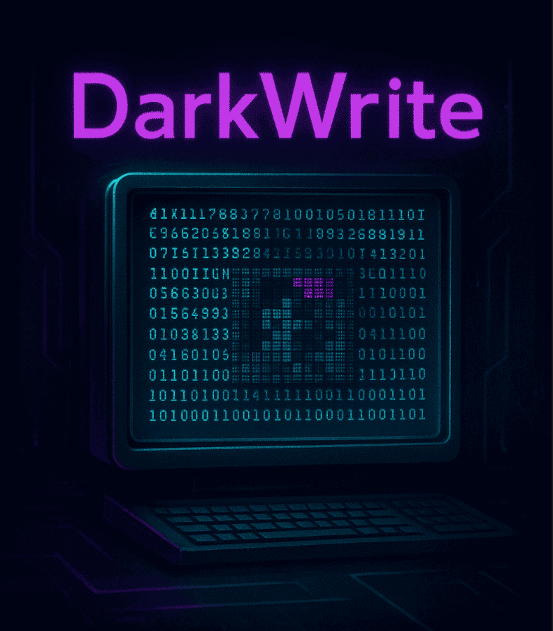

# DarkWrite

---

### Steganography + Encryption = DarkWrite
### Secure communication through invisible data
### 👻 Undetectable  .  🔒 Unbreakable  .  🚀 Unstoppable

---
**Trust no platform. Assume no security. Everything is monitored. The only way out? Protect yourself. Encryption isn’t enough : *Makes your messages disappear into the darkness*.**

DarkWrite is an open-source tool for **secure steganography and encryption**, allowing you to hide encrypted messages inside images. Your secrets stay invisible until you decide to reveal them. 

---




> [!WARNING]
> This project is still in early stages and has not received external security review and may contain vulnerabilities. Do not use for sensitive use cases.

## Features ✨
- **Steganography**: Hide messages or files inside images by modifying pixel data.
- **Encryption**: Encrypt messages or files before hiding for extra security.
- **Simple CLI & Command Options**: Use interactive prompts or direct command-line arguments for hiding and extracting messages or files.
- **End-to-End encryption [WIP]**: Planned support for secure key exchange and message confidentiality between sender and receiver.

## Security 🔐
- **Steganography with obfuscation**: DarkWrite uses LSB combined with obfuscation to help evade detection by steganalysis tools¹.
- **Military-Grade Encryption**: Messages and files are encrypted using **AES-256-GCM**, one of the most secure encryption algorithms available today.

> ¹ DarkWrite's steganography has not been detected by any of the steganography detection tools I have had the opportunity to try (with or without encryption).

## Install 💻


### Linux :
```bash
wget https://codeberg.org/judemont/DarkWrite/releases/download/latest/darkwrite
chmod +x darkwrite
sudo mv darkwrite /bin
```
### Windows :
> [!WARNING]
> Microsoft Windows is not suitable for protecting your privacy; do not use it for sensitive cases.

Download the latest darkwrite.exe from the [releases page](https://codeberg.org/judemont/DarkWrite/releases/download/latest/darkwrite).

## Usage 🚀
> [!TIP]
> If you are on Windows, use `darkwrite.exe`.
### Run the program
```bash
darkwrite <COMMAND> [OPTIONS]
```

### Commands & Options

#### Hide a message
```bash
darkwrite hide <MESSAGE> <INPUT_IMAGE> [--key <KEY>] [--output <OUTPUT_PATH>]
```
- `<MESSAGE>`: The message to hide
- `<INPUT_IMAGE>`: Path to the image to use for hiding
- `--key, -k`: AES-256 encryption key (optional)
- `--output, -o`: Output path (default: output.png)

#### Hide a file
```bash
darkwrite hide-file <FILE_PATH> <INPUT_IMAGE> [--key <KEY>] [--output <OUTPUT_PATH>]
```
- `<FILE_PATH>`: Path to the file to hide
- `<INPUT_IMAGE>`: Path to the image to use for hiding
- `--key, -k`: AES-256 encryption key (optional)
- `--output, -o`: Output path (default: output.png)

#### Extract a message or file
```bash
darkwrite extract <IMAGE_PATH> [--key <KEY>] [--output <OUTPUT_PATH>]
```
- `<IMAGE_PATH>`: Path to the image containing the hidden data
- `--key, -k`: AES-256 decryption key (if needed)
- `--output, -o`: Output path to save extracted data (optional)

### Examples
- Hide a message:
  ```bash
  darkwrite hide "My secret message" input.png
  darkwrite hide "My message" input.png --key "my_secret_key" --output "result.png"
  ```
- Hide a file:
  ```bash
  darkwrite hide-file "secret.pdf" input.png --key "my_secret_key" --output "result.png"
  ```
- Extract a message or file:
  ```bash
  darkwrite extract "result.png"
  darkwrite extract "result.png" --key "my_secret_key"
  darkwrite extract "result.png" --key "my_secret_key" --output "file.pdf"
  ```

---

> [!NOTE]
> **Not only** for educational purposes, but for all ethical use of your free speech, everywhere in the cyber-space.